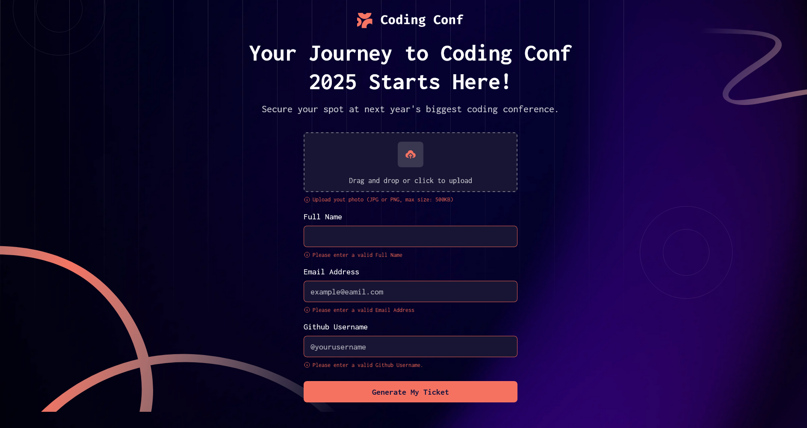
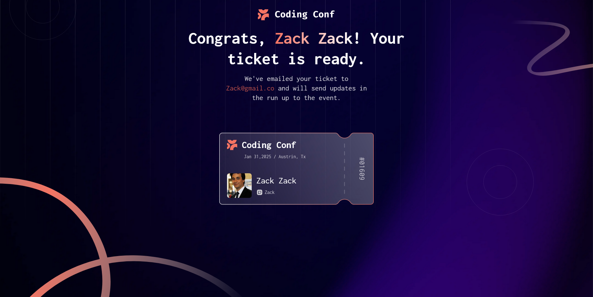

# Frontend Mentor - Conference ticket generator solution

This is a solution to the [Conference ticket generator challenge on Frontend Mentor](https://www.frontendmentor.io/challenges/conference-ticket-generator-oq5gFIU12w). Frontend Mentor challenges help you improve your coding skills by building realistic projects.

## Table of contents

- [Overview](#overview)
  - [The challenge](#the-challenge)
  - [Screenshot](#screenshot)
  - [Links](#links)
- [My process](#my-process)
  - [Built with](#built-with)
  - [What I learned](#what-i-learned)
  - [Useful resources](#useful-resources)

**Note: Delete this note and update the table of contents based on what sections you keep.**

## Overview

### The challenge

Users should be able to:

- Complete the form with their details
- Receive form validation messages if:
  - Any field is missed
  - The email address is not formatted correctly
  - The avatar upload is too big or the wrong image format
- Complete the form only using their keyboard
- Have inputs, form field hints, and error messages announced on their screen reader
- See the generated conference ticket when they successfully submit the form
- View the optimal layout for the interface depending on their device's screen size
- See hover and focus states for all interactive elements on the page

### Screenshot






### Links

- Solution URL: https://github.com/Ouail-Goumidi/Conference-ticket-generator.git
- Live Site URL: https://conference-ticket-generator-nu.vercel.app/

## My process

### Built with

- Semantic HTML5 markup
- CSS custom properties
- Flexbox
- CSS Grid
- Desktop-first workflow
- Vanilla JS


### What I learned

I learned several new features in JavaScript, such as handling the keydown event, implementing drag-and-drop functionality, and working with files. Additionally, I explored how to open new pages with dynamic information using encodeURIComponent and decodeURIComponent. It has been an exciting and rewarding journey!

I also deepened my understanding of responsive design using CSS, which has significantly improved my ability to create user-friendly and adaptable layouts
To see how you can add code snippets, see below:

```js
// Complete With Thier keyboard

document.querySelectorAll("form input").forEach((ele, index, arr) => {
  ele.addEventListener("keydown", (event) => {
    if (event.key === "Enter") {
      if (index < arr.length - 1) {
        event.preventDefault();
        arr[index + 1].focus();
      } else {
        document.querySelector(".submit-button").click();
        ele.blur();
      }
    }
  });
});

```

```js
async function checkGithubUserFromDB(userName) {
  userName = userName[0] === "@" ? userName.slice(1) : userName;
  try {
    const respon = await fetch(`https://api.github.com/users/${userName}`);
    if (!respon.ok) {
      throw new Error("User Not Found");
    }
    return true;
  } catch (e) {
    return false;
  }
}

function checkGithubUser(input) {
  if (input.value !== "") {
    return new Promise((resolve) => {
      checkGithubUserFromDB(input.value).then((result) => {
        if (!result) {
          input.after(gitHubUsernameErrorMessage);
          input.classList.add("error-input");
          resolve(false);
        } else {
          if (input.nextElementSibling !== null) {
            gitHubUsernameErrorMessage.remove();
            input.classList.remove("error-input");
          }
          resolve(true);
        }
      });
    });
  } else {
    input.after(gitHubUsernameErrorMessage);
    input.classList.add("error-input");
  }
}


```

### Useful resources

- [deepseek](https://chat.deepseek.com)
